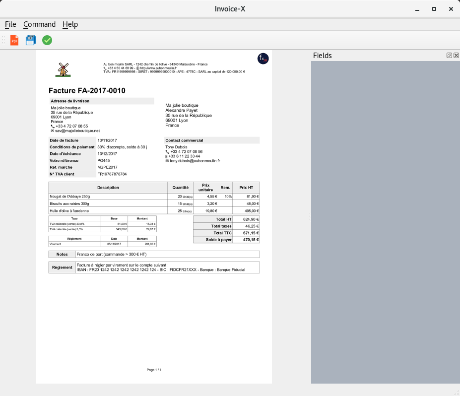

GUI for factur-x - Invoice-X GUI
================================
Graphical User Interface for `factur-x <https://github.com/invoice-x/factur-x>`_ library with basic functionality such as:

- Validate Metadata
- Export Metadata to (json|xml|yml)
- Add xml to PDF
- Extract fields from PDF

The application is built using `PyQt5 <https://www.riverbankcomputing.com/software/pyqt/intro>`_

Status
------
The project is under development

