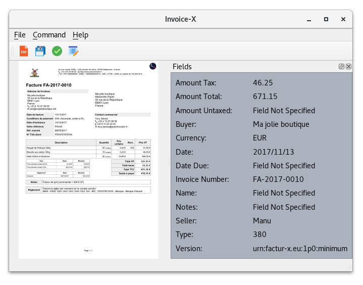
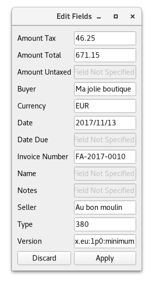

GUI for factur-x - Invoice-X GUI
================================

|Travis CI|

Graphical User Interface for `factur-x <https://github.com/invoice-x/factur-x>`_ library with basic functionalities such as:

- Validate metadata of pdf invoice
- Export metadata to in form of JSON, XML and YAML
- Extract fields from PDF using `invoice2data <https://github.com/invoice-x/invoice2data>`_
- Edit field values (metadata) of pdf invoices

**TODO**

- Add external XML to PDF

The application is built using `PyQt5 <https://www.riverbankcomputing.com/software/pyqt/intro>`_

**Latest Dev release**

v0.0.3

- Linux: `Linux Package <https://github.com/invoice-x/invoicex-gui/releases/download/v0.0.3/invoicex-gui-v0.0.3dev-linux.tar.gz>`_
- Windows: `Windows executable <https://github.com/invoice-x/invoicex-gui/releases/download/v0.0.3/invoicex-gui-v0.0.3dev-Windows.zip>`_
- MacOS: `MacOS executable <https://github.com/invoice-x/invoicex-gui/releases/download/v0.0.3/invoicex-gui-v0.0.3dev-MacOS.zip>`_

Requirements
------------

- PyQt5 v5.10.1
- PyPDF2
- lxml
- PyYAML
- invoice2data

External Dependencies:

- Imagemagick: `<https://www.imagemagick.org/script/download.php>`_
- GhostScript: `<https://www.ghostscript.com/download/gsdnld.html>`_

Running from source
-------

::

    $ git clone https://github.com/invoice-x/invoicex-gui.git
    $ cd invoicex-gui
    $ pip install -r requirements.txt
    $ python main.py

OR run from terminal

::

    $ $ git clone https://github.com/invoice-x/invoicex-gui.git
    $ cd invoicex-gui
    $ python setup.py install
    $ invoicex-gui

Development
-----------

If you are interested in improving this project, have a look at our
`developer guide <DEVELOP.rst>`__ to get you started quickly.

Screenshots
-----------

Author
------
`Harshit Joshi <https://github.com/duskybomb>`_

.. |Travis CI| image:: https://travis-ci.org/invoice-x/invoicex-gui.svg?branch=master
   :target: https://travis-ci.org/invoice-x/invoicex-gui
