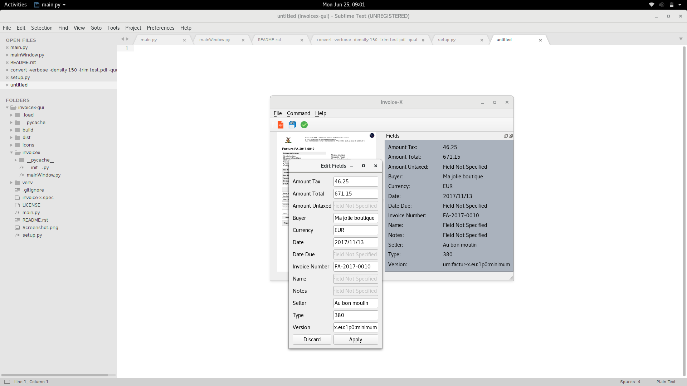

GUI for factur-x - Invoice-X GUI
================================
Graphical User Interface for `factur-x <https://github.com/invoice-x/factur-x>`_ library with basic functionalities such as:

- Validate Metadata
- Export Metadata to (json|xml|yml)
- Add xml to PDF
- Extract fields from PDF
- Edit Fields

The application is built using `PyQt5 <https://www.riverbankcomputing.com/software/pyqt/intro>`_

Status
------

**The project is under development**

Working Features:

- Preview Loaded PDF
- Load metadata to right Dock
- Edit Fields (Doesn't save it to PDF)
.. image:: Screenshot.png

Author
------
- `Harshit Joshi <https://github.com/duskybomb>`_
